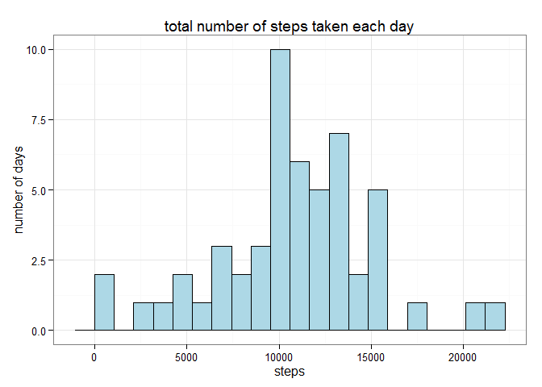
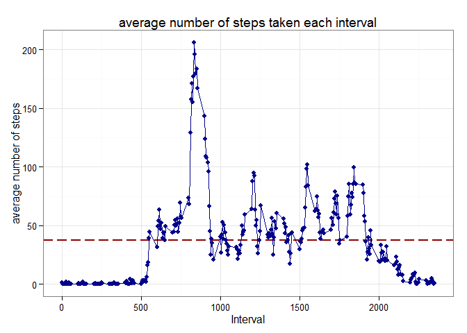
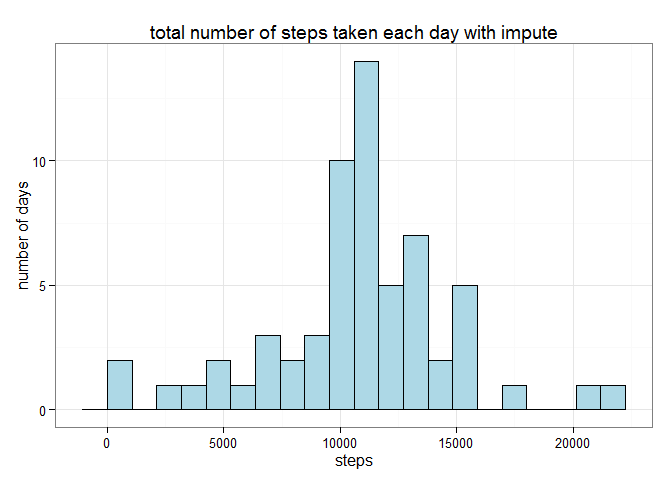
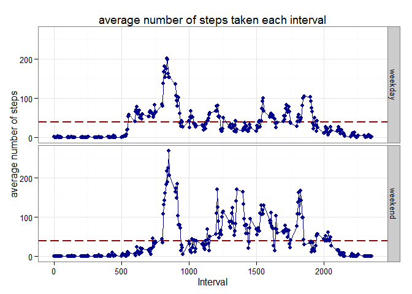

Introduction
============

It is now possible to collect a large amount of data about personal
movement using activity monitoring devices such as a Fitbit, Nike
Fuelband, or Jawbone Up. These type of devices are part of the
“quantified self” movement – a group of enthusiasts who take
measurements about themselves regularly to improve their health, to find
patterns in their behavior, or because they are tech geeks. But these
data remain under-utilized both because the raw data are hard to obtain
and there is a lack of statistical methods and software for processing
and interpreting the data.

This assignment makes use of data from a personal activity monitoring
device. This device collects data at 5 minute intervals through out the
day. The data consists of two months of data from an anonymous
individual collected during the months of October and November, 2012 and
include the number of steps taken in 5 minute intervals each day.

The data for this assignment can be downloaded from the course web site:

<https://d396qusza40orc.cloudfront.net/repdata/data/activity.zip>

The variables included in this dataset are:

-   steps: Number of steps taking in a 5-minute interval (missing values
    are coded as NA)

-   date: The date on which the measurement was taken in YYYY-MM-DD
    format

-   interval: Identifier for the 5-minute interval in which measurement
    was taken

The dataset is stored in a comma-separated-value (CSV) file and there
are a total of 17,568 observations in this dataset.

Code for reading in the dataset and/or processing the data
==========================================================

    library("ggplot2")
    library("lubridate") # function wday(x)

    if (!"activity.csv" %in% dir("./")) {
        print("Downloading File.....")
        download.file(url = "https://d396qusza40orc.cloudfront.net/repdata/data/activity.zip",
                      destfile = "repdata-data-activity.zip")
        unzip(zipfile = "repdata-data-activity.zip")
    }

    data_raw <- read.csv(file = "activity.csv")
    data_raw$date <- as.POSIXct(data_raw$date)

    # subsettiingdata without NAs
    data <- subset(data_raw, !(is.na(steps)))

Histogram of the total number of steps taken each day
=====================================================

    data_sum <- aggregate(steps ~ date, data = data, FUN = sum)
    colnames(data_sum)<- c("date", "steps")

    g1 <- ggplot(data = data_sum, aes(x = steps))
    g1 <- g1 + geom_histogram(aes(y = ..count..),
                              binwidth = max(data_sum$steps) / 20,
                              fill = "lightblue", color = "black")
    g1 <- g1 + labs(title = "total number of steps taken each day",
                    x = "steps", y = "number of days")
    g1 <- g1 + theme_bw() # background black and white
    print(g1)

Mean and median number of steps taken each day
==============================================

The mean of the steps taken each day is given by:

    print(mean(data_sum$steps))

    ## [1] 10766.19

The median of the steps taken each day is given by:

    print(median(data_sum$steps))

    ## [1] 10765

Time series plot of the average number of steps taken
=====================================================

    data_interval <- aggregate(steps ~ interval, data = data, FUN = mean)
    colnames(data_interval)<- c("interval", "steps")

    g2 <- ggplot(data = data_interval, aes(x = interval, y = steps))
    g2 <- g2 + geom_hline(yintercept = mean(data_interval$steps), color = "red4", lwd = 1, lty = 5)
    g2 <- g2 + geom_line(color = "darkblue")
    g2 <- g2 + geom_point(color = "darkblue")
    g2 <- g2 + labs(x = "Interval", y = "average number of steps",
                      title = "average number of steps taken each interval")
    g2 <- g2 + theme_bw()
    print(g2)

The 5-minute interval that, on average, contains the maximum number of steps
============================================================================

    interval_max <- subset(data_interval, steps == max(steps))
    print(interval_max$interval)

    ## [1] 835

Code to describe and show a strategy for imputing missing data
==============================================================

In the rawdata the number of missing steps is given by:

    print(nrow(data_raw) - nrow(data))

    ## [1] 2304

Our imputing strategy is replace NA values for the steps by the mean of
that 5-minute interval

    data_impute <- data_raw
    for (i in 1:nrow(data_impute)) {
        if (is.na(data_impute$steps[i])) {
            data_impute$steps[i] <- data_interval[which(data_interval$interval == data_impute$interval[i]), ]$steps
        }
    }

Histogram of the total number of steps taken each day after missing values are imputed
======================================================================================

    data_impute_sum <- aggregate(steps ~ date, data = data_impute, FUN = sum)
    g3 <- ggplot(data = data_impute_sum, aes(x = steps))
    g3 <- g3 + geom_histogram(aes(y = ..count..),
                              binwidth = max(data_impute_sum$steps) / 20,
                              fill = "lightblue", color = "black")
    g3 <- g3 + labs(title = "total number of steps taken each day with impute",
                    x = "steps", y = "number of days")
    g3 <- g3 + theme_bw() # background black and white
    print(g3)

The mean of the steps taken each day is given by:

    print(mean(data_impute_sum$steps))

    ## [1] 10766.19

The median of the steps taken each day is given by:

    print(median(data_impute_sum$steps))

    ## [1] 10766.19

The mean number of steps remains the same as without imputing the
missing values because we hae imputed only the mean values for each
interval. The median becomes equal to the mean.

Panel plot comparing the average number of steps taken per 5-minute interval across weekdays and weekends
=========================================================================================================

    data_weekday <- subset(data, wday(data$date) < 6)
    data_weekend <- subset(data, wday(data$date) > 5)
    data_weekday$week <- "weekday"
    data_weekend$week <- "weekend"
    data <- rbind(data_weekday, data_weekend)
    data_week <- aggregate(steps ~ interval + week, data = data, FUN = mean)

    g4 <- ggplot(data = data_week, aes(x = interval, y = steps))
    g4 <- g4 + geom_hline(yintercept = mean(data_week$steps), color = "red4", lwd = 1, lty = 5)
    g4 <- g4 + geom_line(color = "darkblue")
    g4 <- g4 + geom_point(color = "darkblue")
    g4 <- g4 + facet_grid(week ~ .)
    g4 <- g4 + labs(x = "Interval", y = "average number of steps",
                    title = "average number of steps taken each interval")
    g4 <- g4 + theme_bw()
    print(g4)

During the week the increase or the activity in the morning is faster.
However the activity in the afternoon is higher across the weekend.
